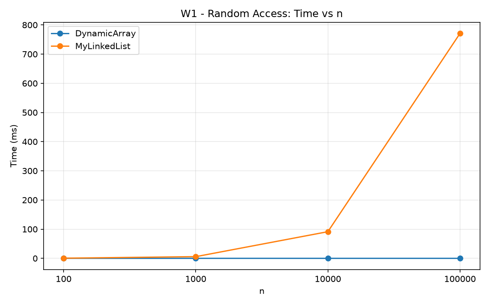
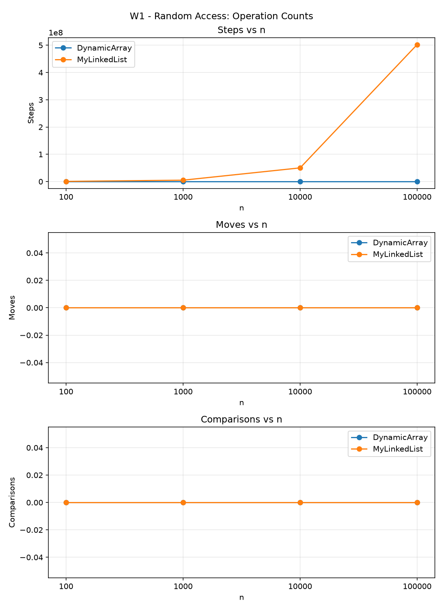
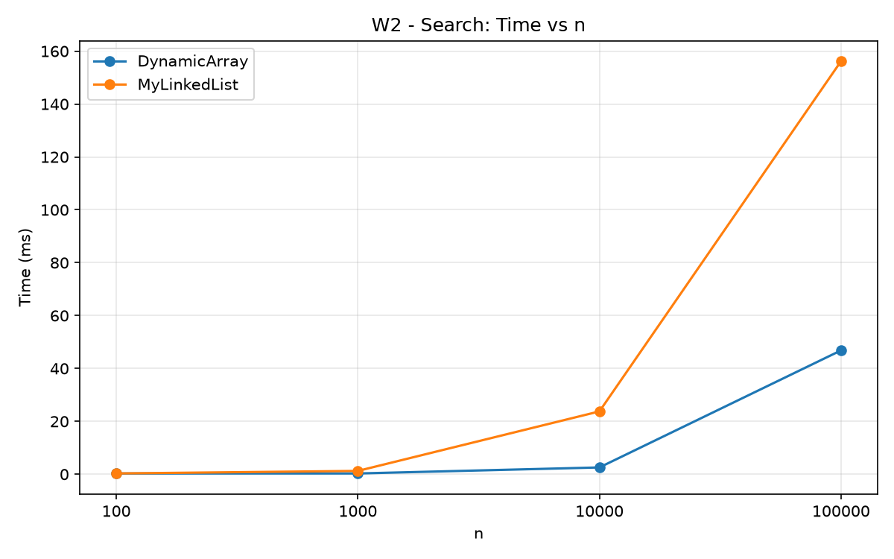
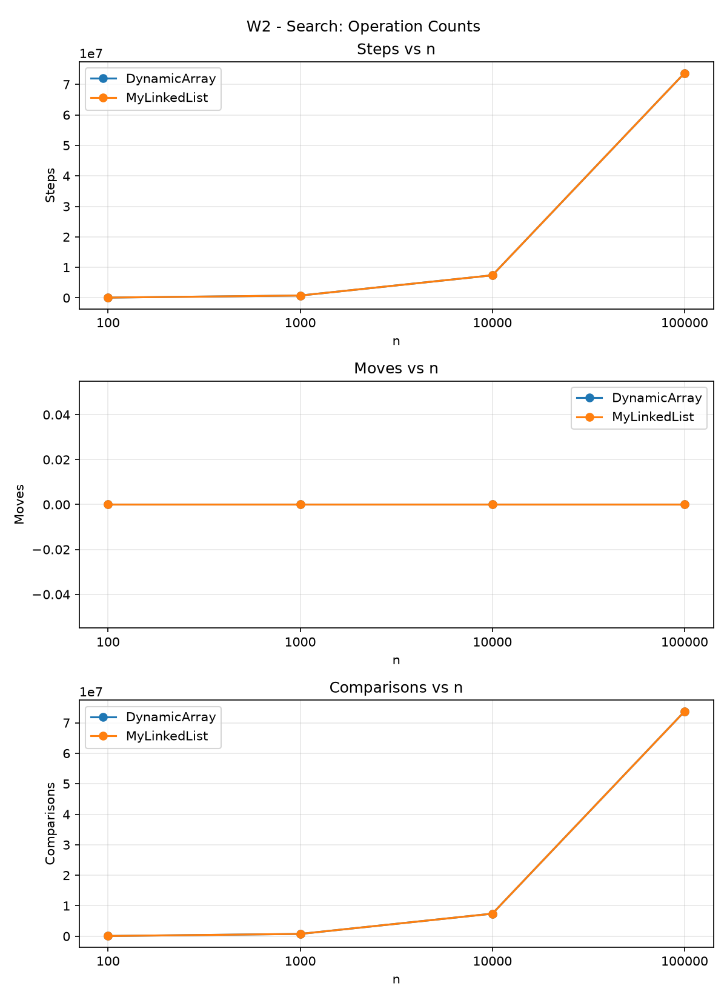
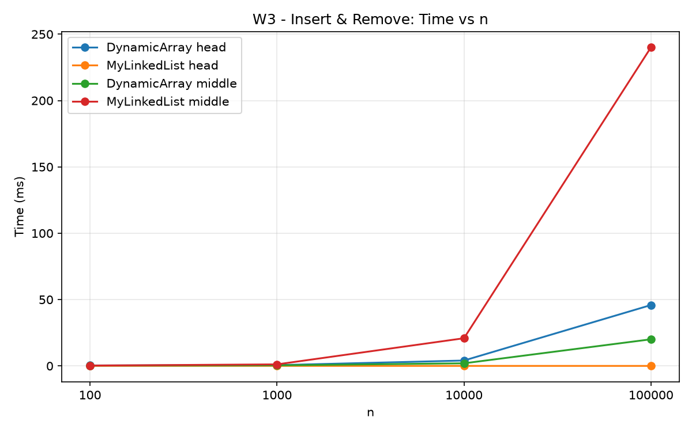
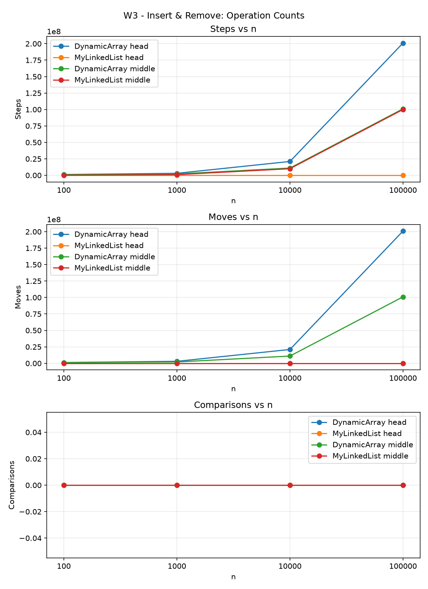
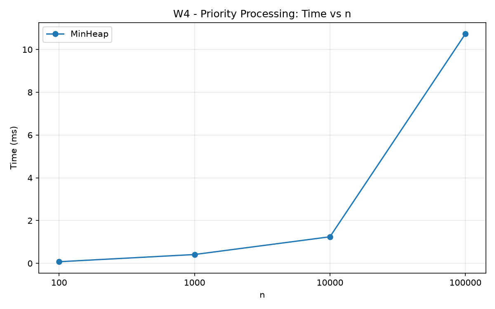
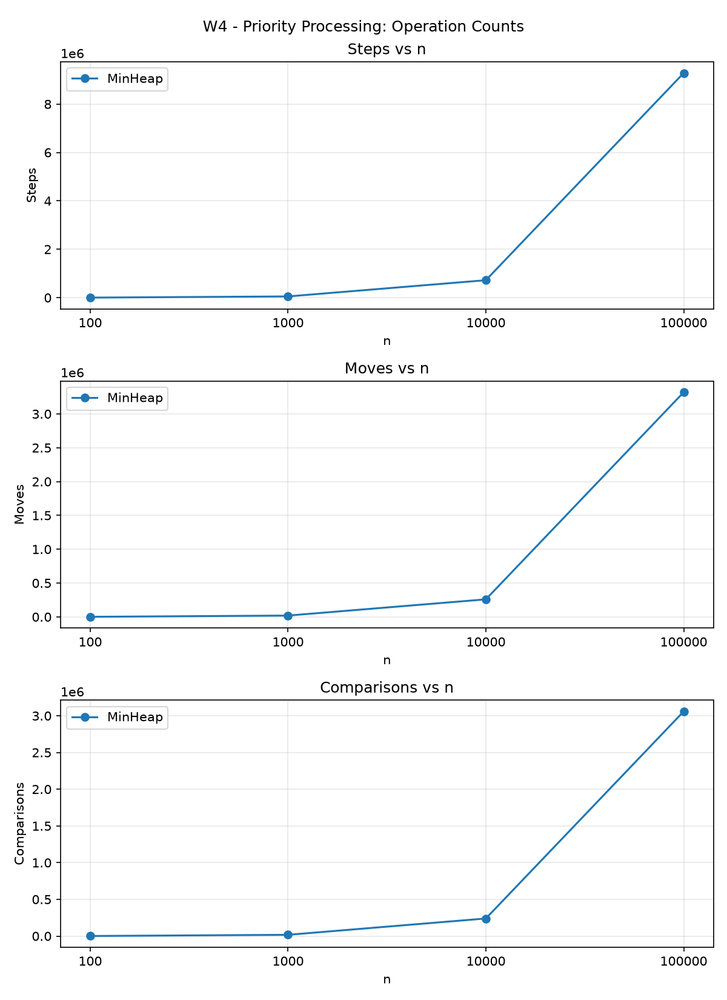

# Assignment 2 - Data Structures Report

## 1. Overview

This project implements three data structures from scratch: `DynamicArray`, `MyLinkedList`, and `MinHeap`. All structures store primitive `int` values. `DynamicArray` and `MinHeap` use `int[]`, while `MyLinkedList` uses nodes with an `int` value and a reference to the next node.

The benchmark uses the following sizes:

`n = 100, 1,000, 10,000, 100,000`

All generated data uses `new Random(42)`. Each benchmark case has one warm-up run that is discarded, followed by five measured runs. The median time of the five measured runs is saved to `results/results.csv`.

The measured counters are:

- **steps** - one array-cell read or one move to the next linked-list node;
- **moves** - one shifted array element or one pointer update in the linked list;
- **comparisons** - one comparison between two element values.

For W1-W3, the structures are filled before the measurement and the counters are reset before the workload begins. W4 includes both heap insertion and extraction because both operations are part of the workload.

---

## 2. Complexity Analysis

### 2.1 DynamicArray

| Operation | Best Case | Average Case | Worst Case | Auxiliary Space | Justification |
|---|---|---|---|---|---|
| `add(x)` | Θ(1) | Θ(1) amortized | Θ(n) | Θ(n) during resize | Usually the value is written directly at the end. When the array is full, all elements are copied to an array with double capacity. |
| `add(index, x)` | Θ(1) | Θ(n) | Θ(n) | Θ(n) during resize | Adding at the end may need no shifts, while insertion near the beginning shifts many elements. A resize may also copy all elements. |
| `remove(index)` | Θ(1) | Θ(n) | Θ(n) | Θ(1) | Removing the last element needs no shifts. Removing near the beginning shifts the remaining elements to the left. |
| `get(index)` | Θ(1) | Θ(1) | Θ(1) | Θ(1) | Array indexing gives direct access to the requested cell. |
| `contains(x)` | Θ(1) | Θ(n) | Θ(n) | Θ(1) | The first element may match immediately, but an absent value requires scanning the whole array. |

The structure itself uses Θ(n) memory for its backing array.

### 2.2 MyLinkedList

| Operation | Best Case | Average Case | Worst Case | Auxiliary Space | Justification |
|---|---|---|---|---|---|
| `add(x)` | Θ(1) | Θ(1) | Θ(1) | Θ(1) | A tail reference allows a new node to be appended without traversing the list. |
| `add(index, x)` | Θ(1) | Θ(n) | Θ(n) | Θ(1) | Insertion at the head or tail is constant time, while a middle insertion requires traversal to the previous node. |
| `remove(index)` | Θ(1) | Θ(n) | Θ(n) | Θ(1) | Removing the head is constant time. Other positions require traversal to the node before the removed node. |
| `get(index)` | Θ(1) | Θ(n) | Θ(n) | Θ(1) | Index 0 is available immediately, but later positions require following `next` references. |
| `contains(x)` | Θ(1) | Θ(n) | Θ(n) | Θ(1) | A match can occur at the head, while an absent value requires visiting the complete list. |

The list itself uses Θ(n) memory, but each element also needs a node object and a reference.

### 2.3 MinHeap

| Operation | Best Case | Average Case | Worst Case | Auxiliary Space | Justification |
|---|---|---|---|---|---|
| `insert(x)` | Θ(1) | O(log n) | Θ(log n) | Θ(n) during resize | If the new value already satisfies the heap property, no swaps are needed. In the worst case it moves from a leaf to the root. A full backing array also requires resizing. |
| `peekMin()` | Θ(1) | Θ(1) | Θ(1) | Θ(1) | The minimum value is always stored at index 0. |
| `extractMin()` | Θ(1) | O(log n) | Θ(log n) | Θ(1) | The last element replaces the root and may move down through the height of the heap. |

Without assuming a particular probability distribution for heap values, the average cases for `insert` and `extractMin` are stated with the safe upper bound O(log n). The heap itself uses Θ(n) storage in its backing array.

---

## 3. Loop Invariant Proofs

### 3.1 DynamicArray `contains(x)`

The relevant loop is:

```java
for (int i = 0; i < size; i++) {
    int value = data[i];

    if (value == x) {
        return true;
    }
}
```

#### Invariant

Before every iteration with index `i`, none of the elements in positions `0` through `i - 1` is equal to `x`.

#### Initialization

Before the first iteration, `i = 0`. No elements have been checked yet, so the range from `0` to `i - 1` is empty. Therefore, the invariant is true.

#### Maintenance

Assume the invariant is true before an iteration. The algorithm reads `data[i]` and compares it with `x`. If they are equal, the method immediately returns `true`, which is correct. If they are not equal, then positions `0` through `i` are all known not to contain `x`. When `i` is incremented, the invariant is true again before the next iteration.

#### Termination

The loop stops in one of two ways. If an equal value is found, the method returns `true`. Otherwise, the loop finishes when `i == size`. By the invariant, all valid positions from `0` to `size - 1` have been checked and none is equal to `x`.

#### Conclusion

Therefore, `contains(x)` returns `true` exactly when `x` exists in the logical part of the array, and returns `false` when it does not.

---

### 3.2 MinHeap `bubbleDown(index)`

The operation starts after `extractMin()` moves the last heap element to the root.

#### Invariant

Before every iteration, the subtrees rooted at the children of `index` are valid min-heaps. The only possible heap-property violation is between the element at `index` and one of its children.

#### Initialization

Before the first iteration, the last heap element has been moved to index 0. Before this replacement, both the left and right subtrees of the root were valid min-heaps. Therefore, only the new root may violate the heap property with one of its children.

#### Maintenance

During an iteration, the algorithm finds the smallest value among the current element and its existing children. If one of the children is smaller, the current element is swapped with the smallest child. The smaller value moves upward, so the heap relation at the old position becomes correct. The moved element may now violate the heap property only with its new children. Therefore, the invariant is true again before the next iteration.

#### Termination

The loop stops when the current element is already no greater than either child, or when it reaches a position without a smaller child. At this point there is no possible violation at `index`. By the invariant, the child subtrees are already valid heaps.

#### Conclusion

Therefore, after `bubbleDown` terminates, the complete structure satisfies the min-heap property `parent <= child`.

---

## 4. Benchmark Results

### W1 - Random Access

W1 performs 10,000 random `get(index)` calls.

<p>
  
  
</p>

The DynamicArray performs exactly 10,000 measured array reads for every tested value of `n`. The linked list needs more traversal steps as `n` increases. At `n = 100,000`, the measured linked-list traversal count is 502,489,208 steps, while DynamicArray still reports 10,000 steps.

### W2 - Search

W2 performs 1,000 `contains(x)` queries. Half of the searched values are present and half are absent.

<p>
  
  
</p>

Both structures have linear search complexity. Their comparison counts are very similar because they inspect similar numbers of values, but their real running times differ because the memory layouts are different.

### W3 - Insert & Remove

W3 performs 1,000 insertions and 1,000 removals. It has `head` and `middle` variants.

<p>
  
  
</p>

The linked list is especially effective for operations at the head because these operations only change a small number of links. In the measured head workload, MyLinkedList reports 1,000 traversal steps and 3,000 pointer moves for every tested `n`. DynamicArray performs many element shifts, so its work increases strongly with the size of the array. For the middle workload, the linked list must traverse about half of the list before each operation, so its cost also increases with `n`.

### W4 - Priority Processing

W4 inserts all `n` values into MinHeap and then calls `extractMin()` exactly `n` times. The benchmark also verifies that extracted values are in non-decreasing order.

<p>
  
  
</p>

The operation counts grow faster than linearly because insertion and extraction may move through the height of the heap. This agrees with the O(log n) cost of individual heap updates.

---

## 5. Discussion

The benchmark results show clear practical differences between the three data structures. In W1, DynamicArray is much faster for random indexed access because `get(index)` uses direct array indexing. The values of an `int[]` are stored in contiguous memory, so nearby elements can be loaded together in CPU cache lines. This spatial locality also makes simple array iteration efficient. MyLinkedList cannot calculate the address of an element directly and must follow `next` references one node at a time. This pointer chasing creates more dependent memory accesses and can cause more CPU cache misses. In W2, both DynamicArray and MyLinkedList have Θ(n) search complexity, but the array is still faster at larger sizes in the measured results. This shows why equal Big-O complexity does not guarantee equal real running time. Each linked-list node is a separate object and has additional memory overhead such as an object header and a reference field. A large number of separate node objects can also create more work for the garbage collector. W3 shows that MyLinkedList is a good choice when insertions and removals happen at the head because only a few pointer updates are necessary. For middle operations, however, the list first has to traverse many nodes, so its advantage disappears as `n` grows. DynamicArray performs many shifts in W3, but sequential array movement can still benefit from good cache locality. MinHeap is the better choice when the application repeatedly needs the smallest-priority element because `peekMin()` is Θ(1) and insertion and extraction are bounded by O(log n). The measurements therefore show that the best data structure depends both on asymptotic complexity and on the actual memory-access pattern of the workload.

---

## 6. Conclusion

`DynamicArray` is the best choice for fast indexed access and cache-friendly sequential work. `MyLinkedList` is useful when operations happen at the head or when pointer updates avoid large array shifts. `MinHeap` is suitable for priority processing where the minimum element must be accessed and removed efficiently.

The benchmark confirms that theoretical complexity is important, but memory layout, cache locality, pointer chasing, and object overhead also have a strong effect on real execution time.
